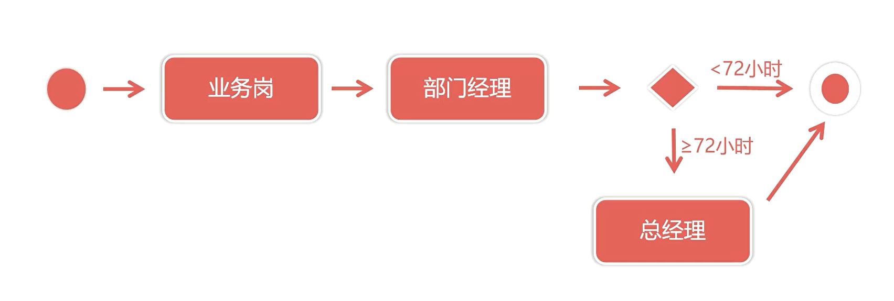
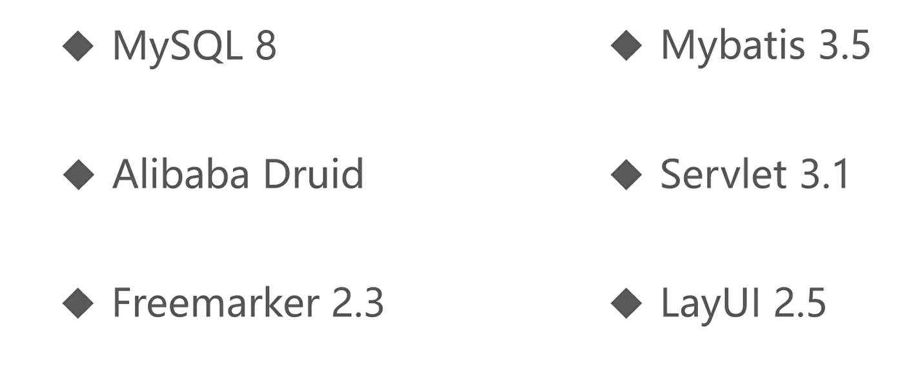

# OA系统

办公自动化系统


### 需求

- 采用多用户的 `B/S` 架构
- 主用户分配系统账户，下级用户使用该账户登录系统
- 采用分级定岗，一共分为八级


### 具体要求

- `6` 级含以下为 `业务岗`
- `7` 级 `部门经理`
- `8` 级 `总经理`





### 框架及组件




### `RBAC`

基于角色的权限控制是面向企业安全策略的访问控制方式

核心思想：将控制访问的资源和角色绑定


### `md5` 摘要算法

`MD5` 可以产生一个 128 位的散列值用于唯一标识原数据


- 压缩性，`MD5` 生成的摘要长度固定
- 抗修改
- 不可逆，无法通过反向推算源数据

> `Commons-Codec`
> `Apache` 提供的编码 / 解码组件

```java
String md5 = DigestUtils.md5Hex(String source);
```

##### 敏感数据加盐处理
在散列中任意固定的位置插入特定的字符串，其作用让加盐之后的散列结果和加盐前不同，这个处理可以增加额外的安全性
大部分情况，盐是不需要保密的。盐可以是随机的字符串，插入位置也可以是随意的。如果将来这个散列的结果需要验证(验证用户输入的密码)，则需要将已使用的盐记录下来

### 工作流程表设计
* 请假单表
* 审批任务流程表
* 消息通知表

##### 设计表单
* 每一个请假单对应一个审批流程
* 请假单创建之后，按照业务规则生成部门经理、总经理审批任务
* 审批任务只能审批自己辖区的请假申请
* 所有的审批任务通过，代表请假批准
* 任意审批任务驳回，其余任务取消，请假申请驳回
* 请假流程中的任意操作都要生成对应的系统通知

### 请假单流程服务
1. 持久化 form 表单数据，8级以下员工表状态为 processing，8级(总经理) 状态为 approved
2. 增加第一条流程数据，说明表单已经被提交，状态 complete
3. 分级判断以下条件
   1. 7 级以下员工，生成部门经理审批任务，请假时间如果大于36小时，生成总经理审批任务
   2. 7 级员工，生成总经理审批任务
   3. 8 级员工，生成总经理审批任务，系统自动通过

##### `sweetalter`
类似于 `layui`，用来替代 `javaScript` 弹出框